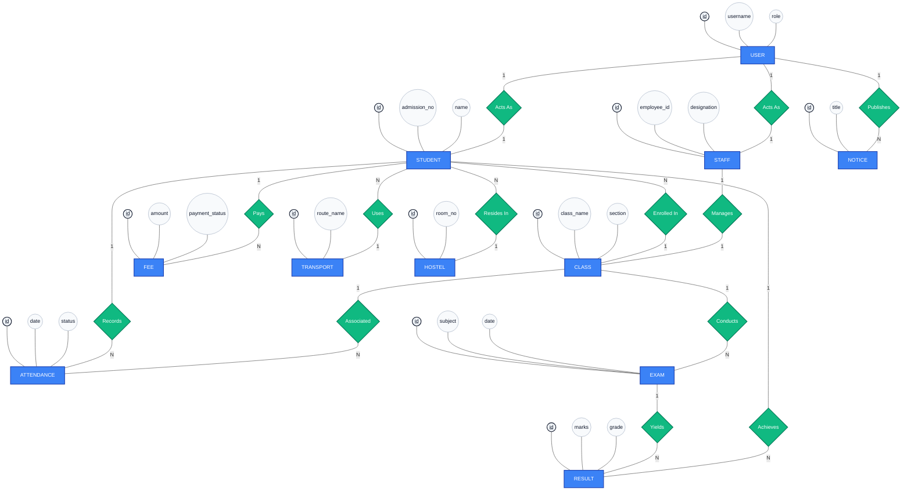

# School Management System - ER Diagram (Chen Notation)

## Abstract
This document outlines the complete Entity-Relationship (ER) architecture for the School Management System (SchoolMS) using Chen Notation. To accurately represent the entire application scope, the schema incorporates fundamental Role-Based Access Control (RBAC) spanning Admins, Teachers, Staff, and Parents, alongside all critical operational modules: **Students, Staff, Classes, Attendance, Fees, Exams, Results, Transport, Hostel, Notices, and Settings**.

## Complete System Chen ER Diagram
Below is the full Chen Notation ER diagram generated dynamically using Mermaid.js.



## Chen Notation Key Principles Explained

If you are using a drag-and-drop tool (like draw.io, Lucidchart, or Visio) instead of an AI generator, follow these visual rules:

### 1. Entities (Rectangles / Blue)
Represent the tables in your database.

### 2. Attributes (Ellipses / Ovals / White)
Represent the columns of your tables. Connect these with a solid straight line to their parent Entity.
*   **Primary Keys (Underlined Text):** E.g., `id` (Always underline the ID).
*   **Standard Attributes:** E.g., `amount`, `class_name`, `status`.

### 3. Relationships (Diamonds / Green)
Represent how entities connect via Foreign Keys in the database operations. E.g., The foreign key `student_id` in the `fees` table creates the "Pays" diamond relationship.

### 4. Cardinality (Lines with Numbers/Letters)
Written on the lines connecting Entities to Relationships.
*   **N to 1**: Many Students use One Transport Route.
*   **1 to N**: One Exam yields Many Results (one for each student).
*   **1 to 1**: One User Login maps strictly to One Staff Employee profile.

## AI Generator Prompt (Gemini Nana Banana)

You can copy and paste the following prompt directly into Gemini (or any advanced LLM) to generate or refine a full, professional ER Diagram using strict Chen Notation.

```text
Act as an expert Database Architect. I need you to create a full, professional Entity-Relationship (ER) Diagram for a comprehensive School Management System. 

You must strictly adhere to all Chen Notation principles:
1. Entities must be represented by Rectangles.
2. Weak Entities must be represented by Double Rectangles.
3. Relationships must be represented by Diamonds.
4. Attributes must be represented by Ovals.
5. Multivalued Attributes must be represented by Double Ovals.
6. Derived Attributes must be represented by Dashed Ovals.
7. Primary Keys must be represented by Ovals with Underlined text.
8. Define the full Cardinality (1:1, 1:N, M:N) and Participation constraints (Total/Partial) clearly on the relationship lines.

The system includes the following core modules: Users (RBAC: Admin, Teacher, Staff, Parent), Students, Staff, Classes, Attendance, Fees, Exams, Results, Transport, Hostel, and Notices. 

Please provide the output as a fully renderable syntax (such as Mermaid.js flowchart with explicit shape declarations matching Chen notation, or PlantUML) OR provide a highly detailed textual blueprint of the diagram that can be directly imported or drawn into a tool like draw.io, Visio, or Lucidchart. Make the architecture production-ready, highly detailed, and professional.
```
