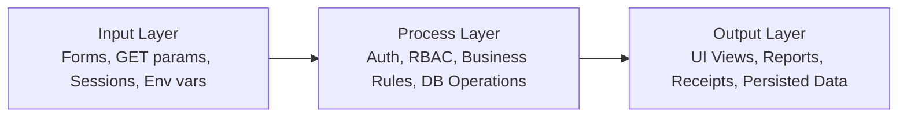

# SchoolMS Layered Architecture

Last updated: 2026-04-19

This document describes the SchoolMS architecture using three logical layers:

- Input Layer
- Process Layer
- Output Layer

## 1. Input Layer

The Input Layer captures and validates user and system inputs.

### Entry points

- Root pages: login.php, dashboard.php, request_account.php, profile.php
- Module pages: students/, staff/, attendance/, fees/, exams/, results/, transport/, hostel/, settings/, notices/

### Input sources

- Browser forms (POST): admissions, attendance, fees, account requests, settings updates
- URL parameters (GET): filters, record IDs, report selectors
- Session context: user_id, role, csrf token
- Environment variables: DB_HOST, DB_USER, DB_PASS, DB_NAME, BASE_URL

### Input controls

- Authentication and role checks through includes/header.php
- CSRF token validation on POST requests
- Type checks and constrained values at form and server level
- Prepared statements for database-bound inputs

## 2. Process Layer

The Process Layer executes business rules and data workflows.

### Core processing components

- Access and policy enforcement:
  - includes/header.php
  - includes/sidebar.php
- Configuration and DB connectivity:
  - config/app.php
  - config/database.php
- Utility processing:
  - src/utilities/check_roles.php
  - src/utilities/hash.php

### Business workflows

- Academic: class assignment, attendance marking, exams, result publishing
- Finance: fee creation, partial and full collection, receipt generation
- Operations: transport and hostel assignment lifecycle
- Administration: account request review, role assignment, parent-student linking
- Communication: notice publication and dashboard visibility

### Data layer interaction

Primary schema and patch flow:

- database/schema.sql
- database/patches/001_account_requests.sql
- database/patches/002_add_deleted_status.sql
- database/patches/003_add_student_role.sql
- database/patches/004_fees_paid_amount.sql
- database/patches/005_parent_student_links.sql

## 3. Output Layer

The Output Layer delivers processed information to users and operators.

### UI outputs

- Role-aware navigation and dashboards
- Lists, forms, and management views for each module
- Alerts and validation feedback
- Printable documents (fee receipts, marksheets)

### Data outputs

- Persisted records in MySQL tables
- Updated statuses (attendance, payments, approvals, assignments)
- Report views for attendance and results

### Operational outputs

- Logs in logs/
- Test artifacts in tests/
- Documentation in docs/

## End-to-end flow

## Summary

SchoolMS follows a practical layered architecture where requests enter through controlled inputs, are processed through centralized policy and module logic, and are returned as role-specific views and durable data changes.