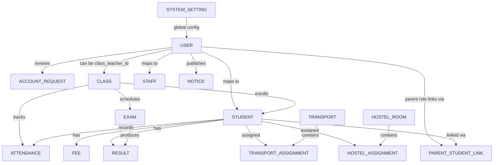

# SchoolMS ER Diagram (Chen Notation)

Last updated: 2026-04-19
Schema source: database/schema.sql

## Scope

This ER reference aligns with the current SchoolMS schema, including onboarding, parent-student links, transport and hostel assignments, and system settings.

## Entities in current schema

- users
- account_requests
- classes
- students
- parent_student_links
- staff
- attendance
- fees
- exams
- results
- transport
- transport_assignments
- hostel_rooms
- hostel_assignments
- notices
- system_settings

## Conceptual Chen-style view (Mermaid)

## Key relationship notes

- Parent visibility is mediated by parent_student_links (not by a single parent column on users).
- Fees support cumulative payments through paid_amount and payment_status.
- Transport and hostel are modeled with separate assignment tables.
- system_settings stores application-wide configuration key-value pairs.

## Role note (users.role)

Current role enum:

- admin
- teacher
- staff
- parent
- student